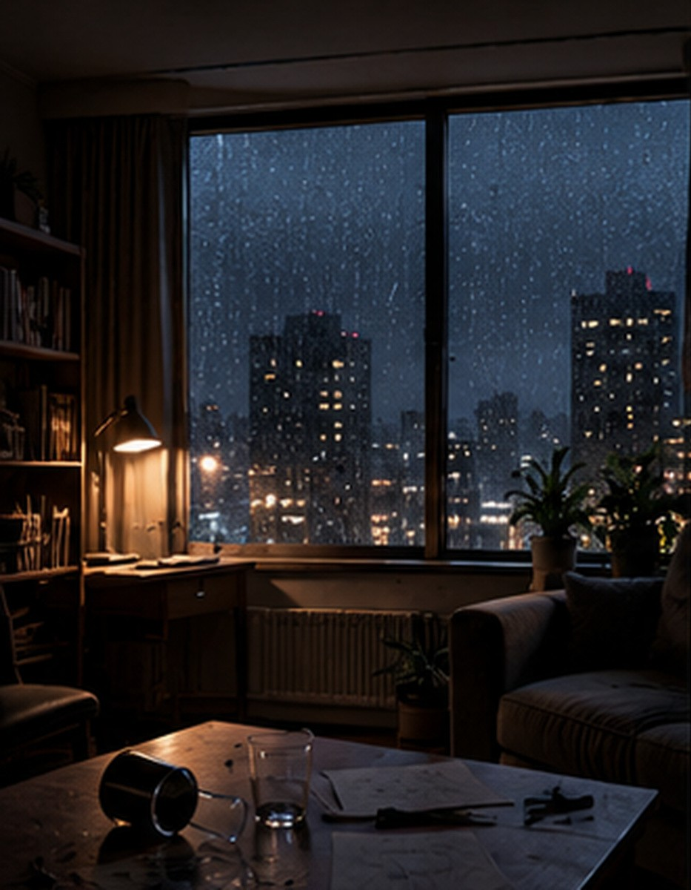

# The Last Statement

A short, choice-based detective game that runs in your browser. No installs, no frameworks, no internet needed.



**Play it:** [add your GitHub Pages link here]

## The case

You are Detective Elias Vale. At 11:47 PM you're called to 17 Bellweather Street, where Mara Venn has been found dead in her apartment. The first report says suicide. But before she died, Mara called the police and said: *"If they tell you I killed myself, don't believe them."*

The scene looks arranged, everyone you talk to is hiding something, and Mara was digging into a death from twelve years ago. Nothing in the case is as simple as it first looks.

## How it plays

- **Examine scenes and talk to people.** Each choice moves the investigation forward.
- **Use evidence against statements.** Clues aren't a checklist. If someone's story doesn't match what you've found, you can confront them, and their answers change based on what you already know.
- **Build your case.** The Evidence Board tracks clues and the connections between them. The Dialogue Log keeps a record of what each person has told you, so you can compare accounts.
- **Make the call.** At the end you name who you believe killed Mara. How much of the deeper story you uncovered decides which of the three endings you get.

A run takes roughly 5 minutes, and different routes lead to different endings.

## Controls

| Key | Action |
| --- | --- |
| Up / Down | Move between choices |
| Enter | Select |
| E | Open the evidence board |
| D | Open the dialogue log |
| Esc | Close a window |

You can also click everything. There's a built-in notepad (NOTES), and your progress and notes are saved automatically in your browser.

## Run it locally

No build step or dependencies. Clone the repo and open `index.html` in a modern browser.

```bash
git clone https://github.com/Saarthak-Khandelwal/the-last-statement.git
cd the-last-statement
```

If your browser blocks the music or images when opening the file directly, serve the folder instead:

```bash
python -m http.server 8000
```

Then visit `http://localhost:8000`. Music starts after your first click, since browsers block autoplay.

## Project structure

```
index.html   page layout and overlays
style.css    styling and the monochrome look
game.js      story, evidence, dialogue and ending logic
scenes/      ten location images
music/       background track
```

## Built with

Vanilla JavaScript, HTML and CSS. Scene photos are turned into the game's monochrome style with CSS filters, and the story is a node-based dialogue system with evidence-dependent responses.

## Credits

Music: Dark Suspense Thriller by alex-morgan (Pixabay)

Made by [Saarthak Khandelwal](https://github.com/Saarthak-Khandelwal).
